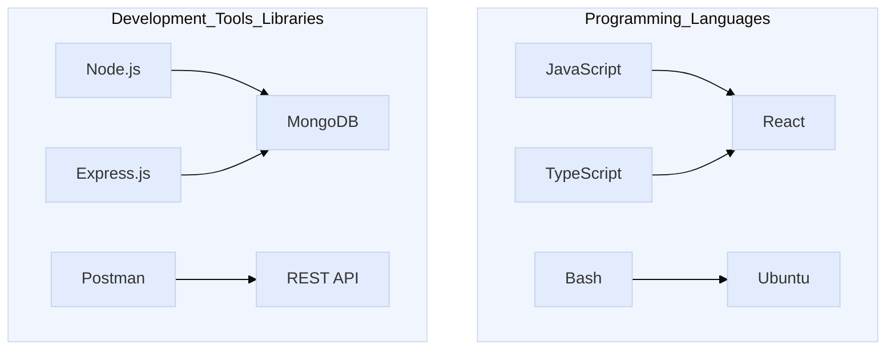

### Hey there 👋, I'm Alejandro

Full Stack developer at [Code The Dream](https://codethedream.org)  
Volunteer at [Open Source San Jose](https://opensourcesanjose.org/)

- ⚙️ Currently working on [TallyUP](https://github.com/codeforsanjose/TallyUp/tree/main) 
- 👨‍💻 My projects are available on my [portfolio](https://alejandropatino.io)
- 💬 Ask me about my [NeoVim](https://github.com/Alejandro-Patino-Camargo/nvim-config) workflow
- 📫 Reach me at [linkedIn](https://www.linkedin.com/in/alejandropatinoc/)

